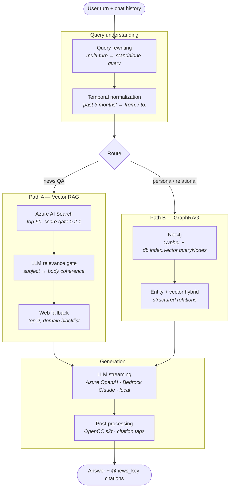

# 🤖 RAG Chatbot — Vector RAG vs. GraphRAG

A research prototype comparing **two retrieval architectures** for grounded question answering:
classic **vector RAG** (Azure AI Search) and **GraphRAG** (Neo4j + vector index),
served behind one FastAPI application.

> **The problem this started from:** keyword search cannot answer
> *"what happened with NVIDIA in the past three months"* — it matches strings, not meaning,
> and it has no idea what "past three months" is.
> Naive vector RAG fixes the first half. It does **not** fix the second half,
> and it does not tell you where the answer came from.
> This repo is where I worked out the parts in between.

> ⚠️ **Disclaimer** — Research and demonstration prototype. Not for production or commercial use.
> Built to compare traditional RAG and GraphRAG architectures. All datasets included here are
> public (Kaggle / 16personalities); no proprietary data is present.

---

## 🏗️ Architecture



---

## 🔍 What is actually interesting here

Most RAG demos stop at *embed → search → stuff into prompt*. The parts that took the real work:

### 1. Temporal normalization is a separate stage
`"台積電上個月營收"` has to become `"台積電營收 from: 2024-06-01, to: 2024-06-30"`
**before** retrieval, otherwise the filter cannot be applied and the model silently answers
with whatever it found. Relative expressions (`last week`, `past 4 months`, `2023 Q4`,
`去年九月`) are resolved against the current date in a dedicated prompt stage, and left
untouched when the query has no temporal component at all — the "do nothing" case is the
one that breaks most naive implementations.

### 2. Retrieval quality gating, not just top-k
Retrieved documents pass a score threshold (`threshold_score = 2.1`) and then an **LLM
relevance judge** that checks whether a document's `body` actually delivers on its
`subject`. Documents that are on-topic by embedding distance but substantively empty get
dropped. When nothing survives, the pipeline falls back to live web retrieval
(top-2 results, with a domain blacklist) rather than letting the model improvise.

### 3. Citations are enforced at the format level
Answers terminate with `@[news_key1][news_key2]`, appended once at the very end rather than
per paragraph. This makes the grounding *checkable* — you can trace any claim back to a
source document ID instead of trusting the model.

### 4. Two retrieval topologies, one API
Vector search answers *"what does the corpus say about X"*.
It is weak at *"what connects A and B"* — that is a graph traversal, not a distance metric.
The MBTI/persona path uses Neo4j with a hybrid of Cypher entity lookup and
`db.index.vector.queryNodes`, and returns structured relations that flat chunk retrieval
loses. Having both behind one interface is what makes the comparison honest.

### 5. Model-agnostic generation layer
Azure OpenAI, AWS Bedrock (Claude), and local HuggingFace models sit behind one interface
with streaming support. Output passes through OpenCC `s2t` conversion — simplified-Chinese
leakage is a real and persistent failure mode when serving Traditional Chinese users.

---

## 📁 Module map

| File | Responsibility |
|------|----------------|
| `pipline.py` | FastAPI app — `/chat` (news QA), `/crawl` (web fallback), `/graph` (GraphRAG) |
| `prompt.py` | All prompt templates: query rewriting, temporal normalization, grounded answering, relevance judging |
| `service.py` | Azure service layer — AI Search client, index lifecycle, Blob storage |
| `llm_initial.py` | Multi-backend model interface — Azure OpenAI / Bedrock / local, streaming + chunked |
| `neo.py` | Neo4j operations — ingest, CRUD, hybrid `query_neo4j`, raw Cypher |
| `processing.py` | Utilities — web crawling, date math, format conversion, full/half-width normalization |
| `datapreprocessing.py` | Corpus preparation into index-ready records |
| `Chunking-Text-Splitting.py` | Semantic chunking strategies |
| `yolo_clip_crop.py` | Side project — YOLO + CLIP subject-aware image cropping |
| `config.py` | Configuration and credentials (all values blank by default) |
| `index.html` | Minimal front-end for manual testing |

---

## ⚠️ Known limitations

Stated plainly, because a prototype that hides its edges is not useful to read:

- **No automated evaluation harness.** Retrieval quality was assessed by inspection, not by
  a scored test set. Building that properly is the subject of a
  [separate project](https://github.com/JiangAllen/patent-pipeline-demo).
- **Temporal normalization is prompt-based**, not a parser. It fails on genuinely ambiguous
  phrasing and cannot be unit-tested the way a grammar could.
- **The LLM relevance judge is unvalidated** against human agreement. I later found, in
  another project, that local judges can be 100% format-stable while agreeing with human
  labels 0% of the time — so treat this gate as a heuristic, not a measurement.
- Config is a flat module rather than validated settings; fine for research, wrong for production.

---

## ⚡ Quick Start

### Prerequisites
- Python **3.10+**
- Credentials for your chosen LLM provider, Azure AI Search, and Neo4j

### Setup

```bash
git clone https://github.com/JiangAllen/rag-chatbot.git
cd rag-chatbot

python -m venv venv
venv\Scripts\activate        # Windows
source venv/bin/activate     # Linux/macOS

pip install -r requirements.txt
```

Fill in `config.py` with your endpoints and keys, then:

```bash
python pipline.py
```

Server runs at `http://localhost:8888`.

### Docker

```bash
docker build -t rag-chatbot .
docker run -d -p 8000:8000 rag-chatbot
```

---

## ⚙️ API

### `POST /chat` — grounded news QA

```json
{
  "history": [
    { "user": "台積電上個月營收如何", "bot": "..." },
    { "user": "那英特爾呢" }
  ]
}
```

Follow-up turns are resolved against history before retrieval —
`"那英特爾呢"` becomes a standalone, date-scoped query.

### `POST /graph` — GraphRAG persona QA

```json
{
  "history": [
    { "user": "INFJ 適合什麼職涯方向", "hr": true }
  ]
}
```

### `POST /crawl` — live web retrieval

Used as the fallback path when corpus retrieval returns nothing above threshold.

---

## 🧩 Troubleshooting

| Symptom | Cause |
|---|---|
| Auth errors on startup | `config.py` values are blank by default — fill them in |
| Empty answers on dated queries | Index has no `datepublish` field, so the time filter matches nothing |
| Simplified Chinese in output | OpenCC conversion is applied post-generation; check it is reachable on your path |
| Neo4j connection refused | `NEO4J_URI` / `NEO4J_AUTH` unset, or the vector index has not been created |

---

## 📚 Related work

- **[patent-pipeline-demo](https://github.com/JiangAllen/patent-pipeline-demo)** — where the
  evaluation problem this repo left open gets solved properly: three-layer evaluation,
  QLoRA fine-tuning, and a falsified LLM-as-judge experiment kept as a negative result.
- **[aws-ragchatbot](https://github.com/JiangAllen/aws-ragchatbot)** — the same retrieval
  problem rebuilt on AWS (Bedrock + OpenSearch Serverless), for a two-cloud comparison.
